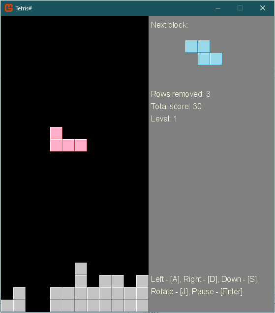

# tetris-sharp
A Tetris game made with CSharp and MonoGame

[](https://dev.azure.com/sunnycoding/TetrisSharp/_build/latest?definitionId=12&branchName=dev)

## Screenshot


## Download
Click [Here](https://daxnetstorageaccount.blob.core.windows.net/artifacts/TetrisSharp_dev.zip) to download the executables. After download, extract all files from ZIP and double click `TetrisSharp.exe` to play.

## Prerequisites
- For development: Microsoft Visual Studio 2019 with .NET Core 3.1
- For build: .NET Core 3.1

## Build
```shell
cd src/TetrisSharp
dotnet build
```

## Publish
```shell
cd src/TetrisSharp
dotnet publish -c Release -o published -r win-x64
```

## Controls
- Moving left: <kbd>A</kbd>
- Moving right: <kbd>D</kbd>
- Moving down: <kbd>S</kbd>
- Rotate block: <kbd>J</kbd>
- Pause: <kbd>Enter</kbd>
- Turn BGM On or Off: <kbd>F12</kbd>

## Customize Blocks
Tetris Sharp allows players to customize the blocks used by the game. Open the `blocks.xml` in a text editor and customize the blocks there.

## About BGM
The BGM was from [here](https://y.qq.com/n/ryqq/songDetail/0030syAa49gxCJ), no commercial use.
