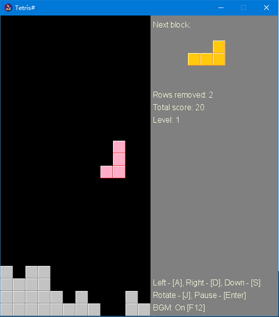

# tetris-sharp
A Tetris game made with CSharp and MonoGame

[](https://dev.azure.com/sunnycoding/TetrisSharp/_build/latest?definitionId=12&branchName=dev)

## Screenshot


## Prerequisites
- For development: Microsoft Visual Studio 2019 with .NET Core 3.1 or .NET 5
- For build: .NET Core 3.1, .NET 5 or .NET 6

## Build
```shell
cd src/TetrisSharp
dotnet build
```

## Publish
```shell
cd src/TetrisSharp
dotnet publish -c Release -o published -r win-x64
```

## Controls
- Moving left: <kbd>A</kbd>
- Moving right: <kbd>D</kbd>
- Moving down: <kbd>S</kbd>
- Rotate block: <kbd>J</kbd>
- Pause: <kbd>Enter</kbd>

## About BGM
The background music was from the artist [GMRemix](https://music.163.com/#/artist?id=29811373). No commercial use.